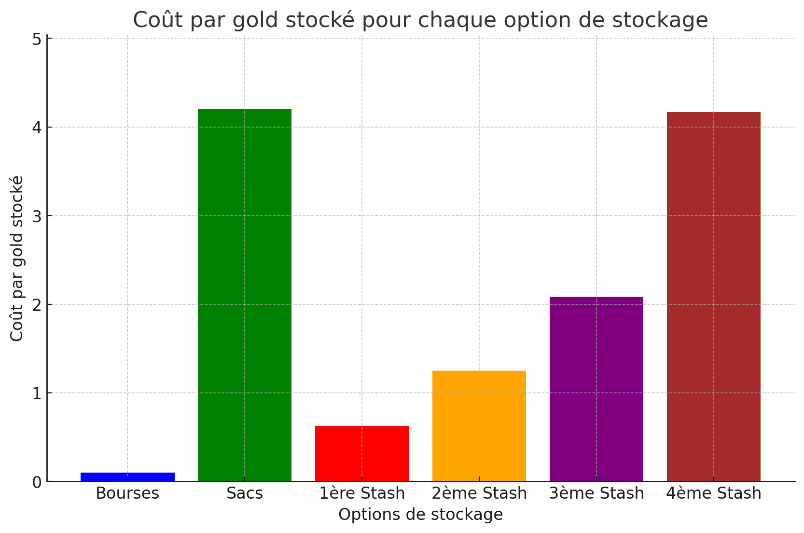
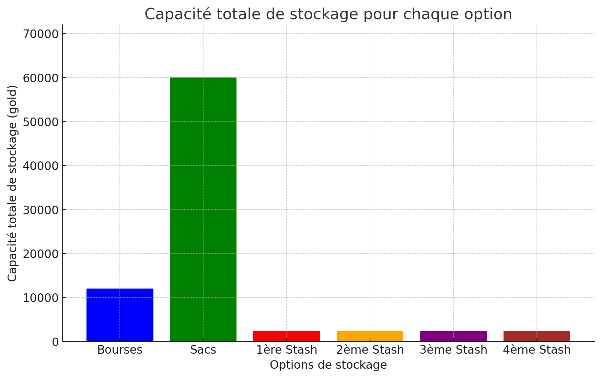

# Stockage de gold

Yo ce petit guide n'a pas vocation à poussé les joueurs à stocker plus d'or, mais juste à ne pas en perdre.
L'or que vous stocker perd de la valeur. 
Si les calculs ne sont pas votre tasse de thé, vous pouvez passer directement à la conclusion de ce guide.

## Table des matières
1. [Problématique](#Problématique)
2. [Calcul de base](#calcul-de-base)
3. [Acheter des bourses](#acheter-des-bourses)
4. [Acheter des sacs](#acheter-des-sacs)
5. [Acheter des stash](#acheter-des-stash)
6. [Comparaison](#comparaison)
7. [Conclusion](#conclusion)
8. [Recommandation](#recommandation)

## Problématique 

Qu'elle solution est la plus rentable à court/long terme pour stocker des gold ? 

- Acheter des bourses, 
- Acheter des sacs,
- Acheter une nouvelle stash.

## Calcul de base

La taille d'une stash est de 12 cases horizontales par 20 cases verticales, ce qui donne :
```
12 * 20 = 240 blocs
```
Chaque bloc peut stocker 10 gold sans rangement spécifique :
```
240 blocs * 10 gold/bloc = 2400 gold
```

## Acheter des bourses

Chaque bourse prend 1 case et peut stocker 50 gold :
```
240 cases * 50 gold/bourse = 12000 gold
```
Le prix d'une bourse est de 5 gold :
```
240 cases * 5 gold = 1200 gold
```

## Acheter des sacs

Chaque sac occupe 4 cases et peut stocker 1000 gold :
```
240 cases / 4 cases/sac = 60 sacs
```

Chaque sac peut stocker 1000 gold :
```
60 sacs * 1000 gold/sac = 60000 gold
```

Le prix d'un sac est d'environ 4200 gold :
```
60 sacs * 4200 gold/sac = 252000 gold
```

## Acheter des stash

### Pallier de prix pour les stashs additionnels

1. 1500
2. 3000
3. 5000
4. 10000

## Comparaison

1. **Bourses** :
   - Coût par gold stocké: 1200 gold / 12000 gold = 0.1 gold/gold

2. **Sacs** :
   - Coût par gold stocké: 252000 gold / 60000 gold = 4.2 gold/gold

3. **Stash supplémentaires** :
   - 1ère stash: 1500 gold / 2400 gold = 0.625 gold/gold
   - 2ème stash: 3000 gold / 2400 gold = 1.25 gold/gold
   - 3ème stash: 5000 gold / 2400 gold = 2.083 gold/gold
   - 4ème stash: 10000 gold / 2400 gold = 4.167 gold/gold

Voici les graphiques représentant le coût par gold stocké et la capacité totale de stockage pour chaque option de stockage :




### Conclusion

1. **À court terme**:
   - **Acheter des bourses** est de loin la solution la plus rentable à court terme avec un coût de 0.1 gold par gold stocké. C'est l'option la plus économique pour un stockage immédiat et important.

2. **À long terme**:
   - **Acheter des stash supplémentaires** peut devenir pertinent après avoir maximisé le stockage via les bourses. À partir de la 3ème stash, les coûts augmentent significativement, et il est alors plus judicieux de considérer cette option si les besoins en stockage augmentent de manière substantielle et que les bourses ne sont plus suffisantes.
   
3. **Acheter des sacs** est nettement la moins rentable des options avec un coût extrêmement élevé de 4.2 gold par gold stocké.

### Recommandation

Pour maximiser le nombre de gold stocké tout en minimisant les dépenses:

1. **Commencer par acheter des bourses** jusqu'à ce que la capacité de 12000 gold soit atteinte.
2. **Ensuite, acheter des stash supplémentaires** pour augmenter la capacité de stockage en fonction des besoins, en surveillant les paliers de coût pour rester dans une fourchette raisonnable.
3. **Éviter d'acheter des sacs** à moins d'avoir des besoins de stockage très spécifiques justifiant leur coût élevé.


